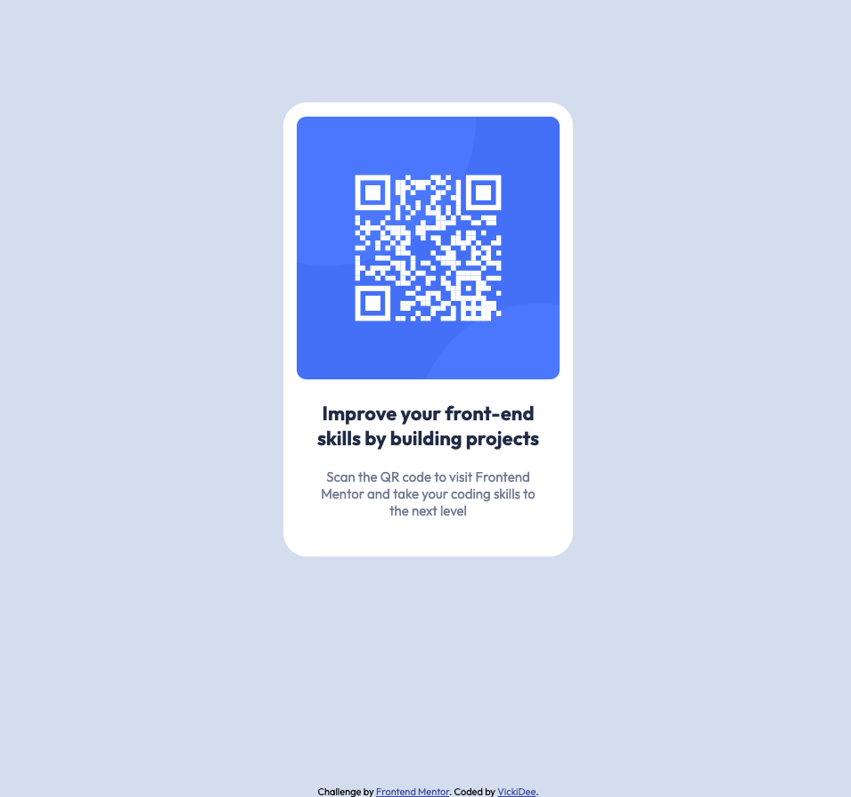

# Frontend Mentor - QR code component solution

This is a solution to the [QR code component challenge on Frontend Mentor](https://www.frontendmentor.io/challenges/qr-code-component-iux_sIO_H). Frontend Mentor challenges help you improve your coding skills by building realistic projects.

## Overview

I started learning to code last year after being out of the industry for a decade+. Frontend Mentor was mentioned in my course slack community and I was a bit hesitant to try but took the plunge after being inspired by another student (Anjie) - seeing her sparkle and excitement about her progress with Frontend Mentor.
This was my first challenge and it was interesting and enjoyable! I challenged myself to code out the html/css before using resources out in the www - my thinking was there but the online searching helped along the way.

### Screenshot

### Links

- Live Site URL:(https://vickidee.netlify.app/)

### Built with

- HTML5
- CSS
- Flexbox
- using VS Code, Chrome, Dev Tools

### What I learned

I learned that I should map the project out first and start top to bottom. Also if I had an idea on code I learned to still add it and comment it out until needed.

### Continued development

I need to refresh myself on Semantic HTML tags. After seeing other coders using CSS var for color I need to learn about this approach as I'm currently only familiar with traditional way. First time I've used Netlify so want to browse around there too.

### Useful resources

- [Example resource 1](https://www.w3schools.com) - This helped me understand the css variable function.

## Author

- Frontend Mentor - [@Vicki-Dee](https://www.frontendmentor.io/profile/Vicki-Dee)
- Instagram - [@wildrushstudio](https://www.instagram.com/wildrushstudio)
- Instagram - [@codingvicki](https://www.instagram.com/codingvicki)
